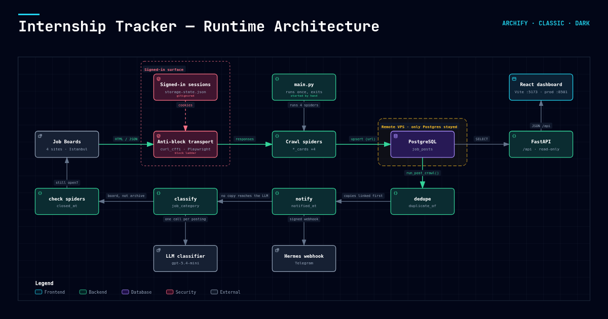

# Internship Tracker

Finding an internship in Istanbul means opening the same five job boards every
day, running the same searches, and scrolling past the same hundred postings
that are not for you. This does that instead: it crawls the boards, keeps the
internships in Istanbul, links the copies of a job that is advertised twice,
asks a local LLM which fields each posting suits, checks whether the ones it
already has are still open, finds the employer's logo where the board gave
none, and puts all of it on one page you can filter in a minute.

**It is for every student, not only software ones.** Until 23.09.2026 a posting
in someone else's line of work was hidden outright; two thirds of a run's
postings disappeared that way. Now every posting carries the field or fields a
student would look under - 25 of them in six groups
([`scraper/fields.py`](scraper/fields.py)) - and the student picks. The only
thing still hidden is a posting that is not an internship at all.

Five sources, all measured rather than guessed - the notes in
[`docs/sites/`](docs/sites/) record what each site does, on what date, and what
was tried before the current approach worked.



The picture was drawn on 02.09.2026, before the fifth board and the field
taxonomy. The transport, the single table and the read path are still shaped
that way; the step order below is the current one.

---

## What runs, and in what order

```
   crawl            dedupe         notify         check        classify       logos
┌──────────┐    ┌──────────┐  ┌──────────┐  ┌──────────┐  ┌──────────┐  ┌──────────┐
│ 5 boards │ ─▶ │ same job │─▶│ watched  │─▶│  still   │─▶│  which   │─▶│ employer │
│10 spiders│    │elsewhere?│  │employer? │  │  open?   │  │ fields?  │  │  logo?   │
└──────────┘    └──────────┘  └──────────┘  └──────────┘  └──────────┘  └──────────┘
      │               │             │             │             │             │
  job_posts      duplicate_of  notified_at    closed_at,    job_post_     company_
                                             description      fields      logo_url
```

`python main.py` runs all six and exits. The order is load-bearing and the
reasoning is in `run_post_crawl()`:

- **dedupe before classify**, so the second copy of a job is never sent to the
  model;
- **check before classify**, because the posting page is where the description
  is, and the description is what the model sorts on. A posting with no
  description is not guessed at - it waits for the next run;
- **logos last**, because nothing waits on them: a posting with no logo is
  already on the board wearing its company's initials.

Every step writes its own column and none of them deletes a row, so any verdict
is one `UPDATE` away from being undone. `scraper/models.py` is the only
description of the schema and says which writer owns which column. The fields a
posting belongs to are the one exception to "its own column": they are rows in
`job_post_fields`, because the dashboard filters on them.

## Where things are

| | |
|---|---|
| `main.py` | the entry point. Runs the crawl and everything after it. |
| `dev.sh` | the other entry point: serves the dashboard locally. |
| `scraper/` | the Scrapy project - spiders, the anti-blocking transport, the schema, the classifier, the field list. |
| `scraper/spiders/` | two per site: `*_cards` collects postings, `*_check` asks whether a stored one is still open. |
| `scraper/proxy_pool.py` | the bought static addresses: which one a site leaves from, and what a refusal costs. |
| `scraper/cookie_jars.py` | one cookie jar per (site, address), so an address can arrive as a returning visitor. Off by default; see below. |
| `pipeline/` | what `main.py` runs after the crawl. Each is also runnable alone with `--dry-run`. |
| `tools/` | run by hand, never by `main.py`: capture a signed-in session, migrate the schema, inspect the pool, measure the classifier. |
| `api/` | FastAPI. Reads `job_posts` and `job_post_fields`, writes nothing. |
| `web/` | the React dashboard it serves. |
| `config/` | `watched_companies.yml` - the employers worth a Telegram ping. |
| `proxies/` | the address list, its metadata, the pool's state and the cookie jars. Git-ignored, mode 600; nothing here is ever committed. |
| `docs/` | the measurements. Start at [`docs/README.md`](docs/README.md). |
| `tests/` | no site, no network, no session. The ones that need a database use an in-memory SQLite. |

## Running it

Python 3.12 or newer (the image uses 3.12, this machine runs 3.14) and Node 22+.

```bash
python3 -m venv .venv
.venv/bin/pip install -r requirements.txt
.venv/bin/playwright install chromium      # kariyer.net, LinkedIn and Youthall
cp .env.example .env                        # then fill in DATABASE_URL at least
.venv/bin/python -m tools.migrate           # add any columns the schema gained
```

Classifying needs a local model server - [Ollama](https://ollama.com) on this
machine, with the model the choice was measured on:

```bash
ollama pull gemma4:12b                      # CLASSIFIER_MODEL, docs/pipeline.md
```

Then:

```bash
.venv/bin/python main.py                    # crawl everything, then sort it
.venv/bin/python main.py --spider indeed_cards
.venv/bin/python main.py --skip-classify    # crawl only: no checks, no sorting
./dev.sh                                    # the dashboard on :5173
./dev.sh --demo                             # ...against generated data instead
```

Each post-crawl step runs on its own and every one of them takes `--dry-run`:

```bash
.venv/bin/python -m pipeline.dedupe_jobs --dry-run
.venv/bin/python -m pipeline.notify_watchlist --dry-run
.venv/bin/python -m pipeline.classify_jobs --dry-run
.venv/bin/python -m pipeline.company_logos --dry-run
```

Tests:

```bash
.venv/bin/pip install -r requirements-dev.txt
.venv/bin/python -m pytest
```

## Where this actually runs

**Nowhere but a laptop.** `main.py` is started by hand; there is no scheduler
and no deployment. The Coolify application that used to run it was deleted on
17.08.2026 and only the Postgres it writes to stayed on the server, which is
why `DATABASE_URL` points off the machine. A push to `main` builds nothing.

**Nothing running means an empty board.** The dashboard shows what a search
result has carried in the last seven days (`UNLISTED_AFTER_DAYS`), so a week
without a run empties it even though every row is still there. The intended
cadence is one run every three days; installing that is still open work.

The `Dockerfile` and `docker-compose.yml` still work and describe the target to
go back to - but going back needs a Chromium layer in the image and the proxy
pool's address list mounted in, because most of these sites will not answer a
datacenter address. The header of `main.py` has the details.

**Three of the five sites need a browser with a WINDOW** - kariyer.net,
LinkedIn and Youthall. Measured 10.09.2026 on kariyer.net: its PerimeterX
answers a headless Chromium with a 9 kB block page and a windowed one with
621 kB of job cards, every other variable held equal
(`docs/sites/kariyernet.md`). A desktop session already provides the display.
Anything unattended - cron, systemd, a container - has to provide one:

```bash
sudo apt install xvfb
xvfb-run -a .venv/bin/python main.py
```

That is a real browser window painted into a virtual screen, which is the
distinction the site is drawing. Without a display the spider refuses to
start and prints this command rather than crawling headless and reporting
zero postings.

**Indeed is the other way round.** Its posting pages answer `curl_cffi`
replaying a Safari handshake and refuse our browser: on 23.09.2026 the browser
got a 401 whose body redirects to
`account/login?...&from=bot-detection-anonymous`, while curl was served 171
posting pages from the same pool addresses that day. So `indeed_check` sets
`INDEED_CHECK_VIA_CURL=1` and no browser is involved
(`docs/proxies.md`, `docs/sites/indeed.md`).

## The addresses, because every site counts them

Requests leave from a pool of bought static residential addresses
(`PROXY_POOL_SPIDERS` decides which spiders use it). European addresses first,
the rest in reserve. The rules are measured, not guessed:

- **a refusal rests that address for 24 hours, for the refusing site only.**
  Measured at Indeed on 23.09.2026: the same address was refused again at 2 h,
  4 h and 20 h, and served at 24 h 01;
- **an address a site has refused before goes last**, behind clean reserves,
  because a flagged address tends to be refused on its first request while a
  clean one carries its full share;
- **no address carries a site's whole run**: after 30 requests it hands over;
- **at most 6 switches per site per run**, since a switch costs one request;
- **a refusal aimed at the client rather than the address rests nothing** - see
  Indeed above.

`python -m tools.proxy_pool status` prints what each address has done per site.
`COOKIE_JARS=1` turns on the per-(site, address) cookie jars; it is off because
it has not been measured on a browser-based site yet, and because the spiders
that open a throwaway context per posting bypass it by design.

## Two things worth knowing before changing anything

**Sessions are accounts.** `indeed-storage-state.json` and
`linkedin-storage-state.json` are a signed-in browser, not a config file. They
are gitignored and they stay that way. Indeed's crawl uses one from the home
address; nothing signed in ever leaves from a pool address. LinkedIn was
crawled with a throwaway account on purpose once, and it closed two of them in
September - so **LinkedIn is crawled as a guest now, with no account at all**,
and its spiders refuse to start unless they are listed in `PROXY_POOL_SPIDERS`
(`docs/sites/linkedin.md`).

**Measure, then write it down, then write the code.** A number in a spider -
`GEO_ID = "90010422"`, `f_E=1` - is unmaintainable without a record of where it
came from, and this repo is unusually strict about that: every rule in
`docs/sites/` carries the date it was measured and what was tried first.
Reversals are dated rather than deleted, so LinkedIn's file still opens with
the argument for dropping it.
